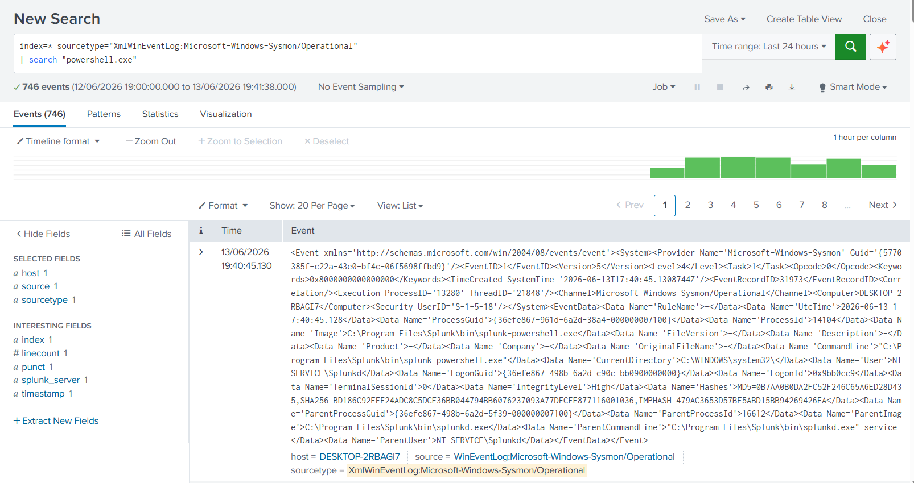
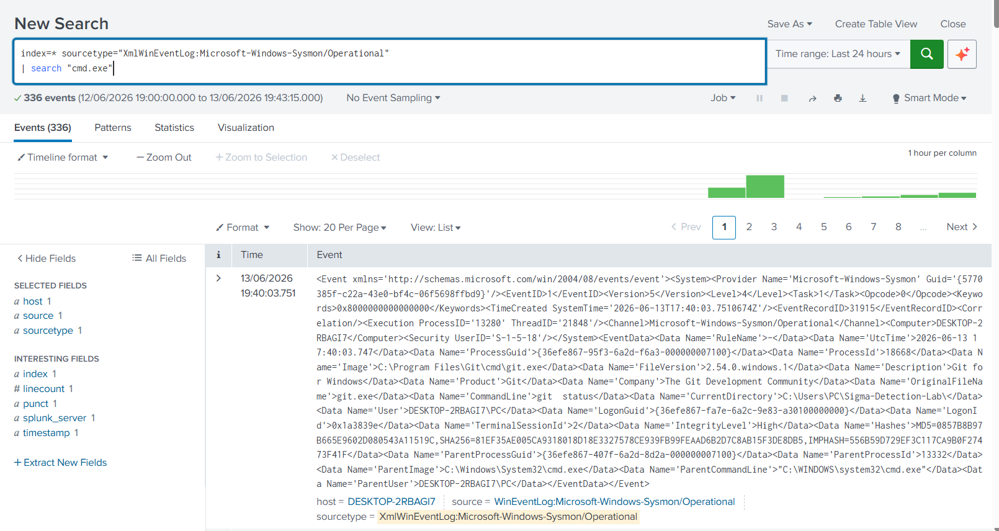
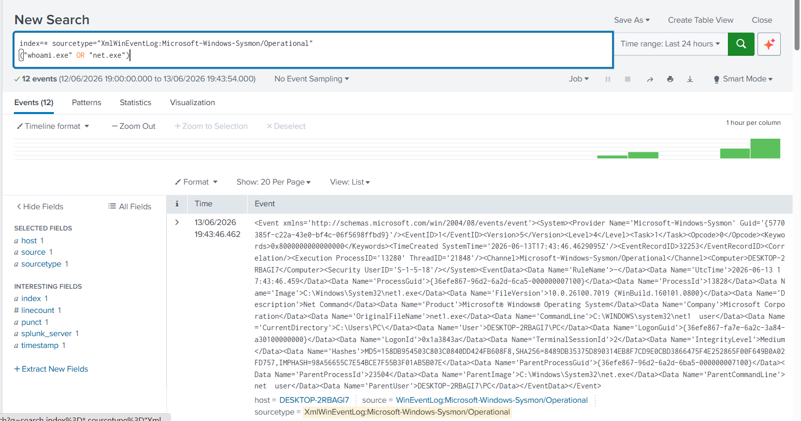
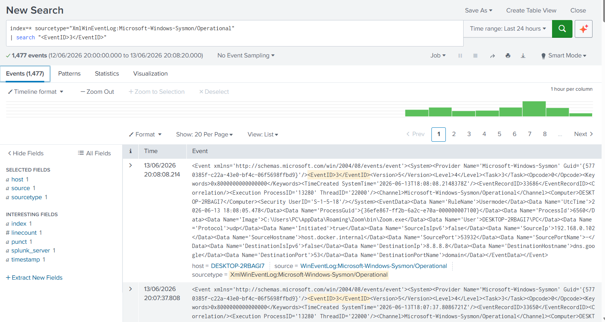
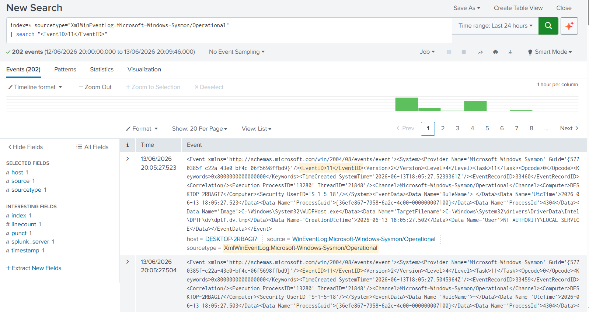

# Threat Hunting Lab

## Overview

This project demonstrates threat hunting activities using Splunk Enterprise and Sysmon telemetry.

The objective is to proactively identify suspicious behavior, investigate potential threats, and validate findings using real Windows event data.

---

## Environment

| Component           | Details                |
| ------------------- | ---------------------- |
| SIEM                | Splunk Enterprise 10.4 |
| Endpoint Monitoring | Sysmon                 |
| Operating System    | Windows 11             |
| Framework           | MITRE ATT&CK           |

---

# Hunting Scenarios

## 1. PowerShell Activity Hunt

### Objective

Identify PowerShell execution that may indicate attacker activity.

### SPL Query

```spl
index=* sourcetype="XmlWinEventLog:Microsoft-Windows-Sysmon/Operational"
| search "powershell.exe"
```

### Result

PowerShell process execution events were successfully identified.



---

## 2. Command Prompt Activity Hunt

### Objective

Identify command-line execution activity.

### SPL Query

```spl
index=* sourcetype="XmlWinEventLog:Microsoft-Windows-Sysmon/Operational"
| search "cmd.exe"
```

### Result

Command Prompt executions were detected and analyzed.



---

## 3. Account Discovery Hunt

### Objective

Identify account enumeration techniques commonly used by attackers.

### SPL Query

```spl
index=* sourcetype="XmlWinEventLog:Microsoft-Windows-Sysmon/Operational"
("whoami.exe" OR "net.exe")
```

### Result

Account discovery activity was successfully identified.



---

## 4. Network Connections Hunt

### Objective

Identify outbound network connections created by processes on the endpoint.

### SPL Query

```spl
index=* sourcetype="XmlWinEventLog:Microsoft-Windows-Sysmon/Operational"
| search "<EventID>3</EventID>"
```

### Result

Sysmon Network Connection events (Event ID 3) were detected and reviewed.



---

## 5. File Creation Hunt (MITRE ATT&CK T1105)

### Objective

Identify file creation activity that could indicate payload delivery or malware staging.

### SPL Query

```spl
index=* sourcetype="XmlWinEventLog:Microsoft-Windows-Sysmon/Operational"
| search "<EventID>11</EventID>"
```

### Result

Sysmon File Creation events (Event ID 11) were successfully identified.



---

## MITRE ATT&CK Mapping

| Technique ID | Technique                            |
| ------------ | ------------------------------------ |
| T1059.001    | PowerShell                           |
| T1087        | Account Discovery                    |
| T1105        | Ingress Tool Transfer                |
| T1049        | System Network Connections Discovery |
| T1059.003    | Windows Command Shell                |

---

## Skills Demonstrated

* Threat Hunting
* Splunk SPL
* Sysmon Analysis
* Windows Event Analysis
* Detection Engineering
* MITRE ATT&CK Mapping
* Security Monitoring
* Incident Investigation

---

## Author

Agata Gabara

Cybersecurity | SOC Analyst | Threat Hunter

GitHub: https://github.com/ag48665
